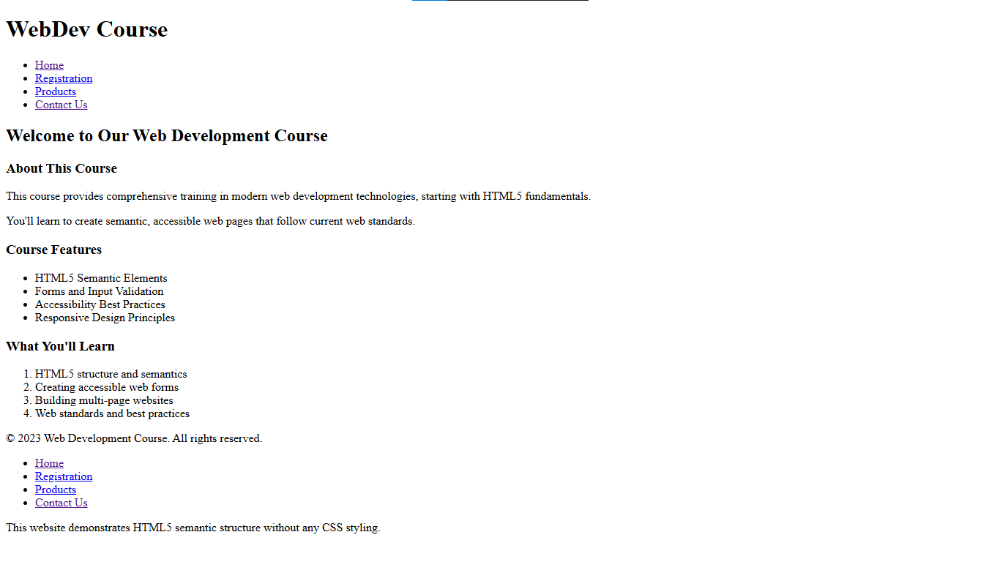
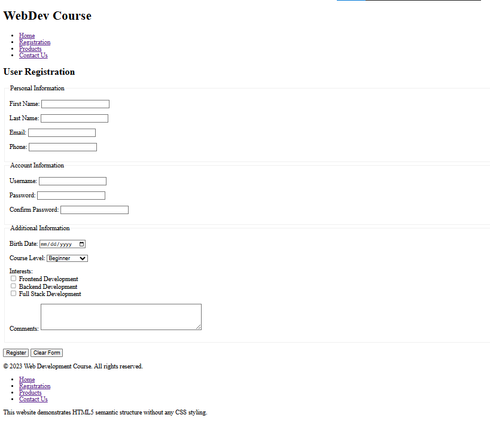
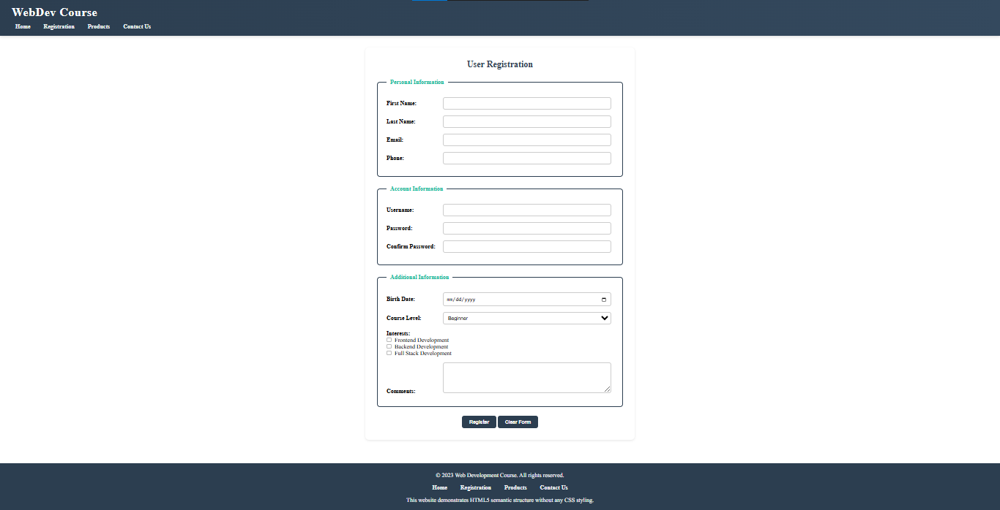
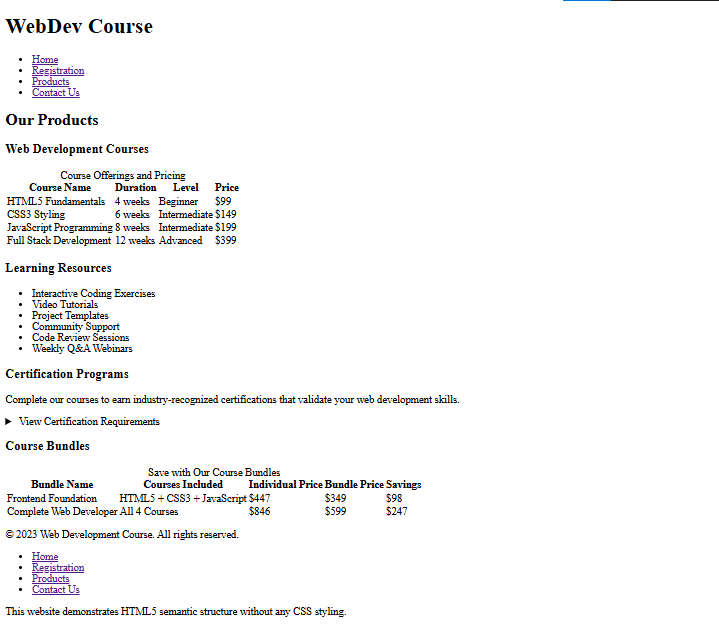
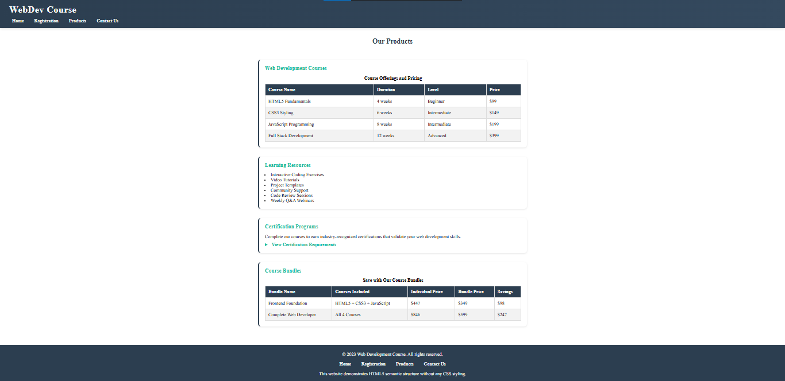
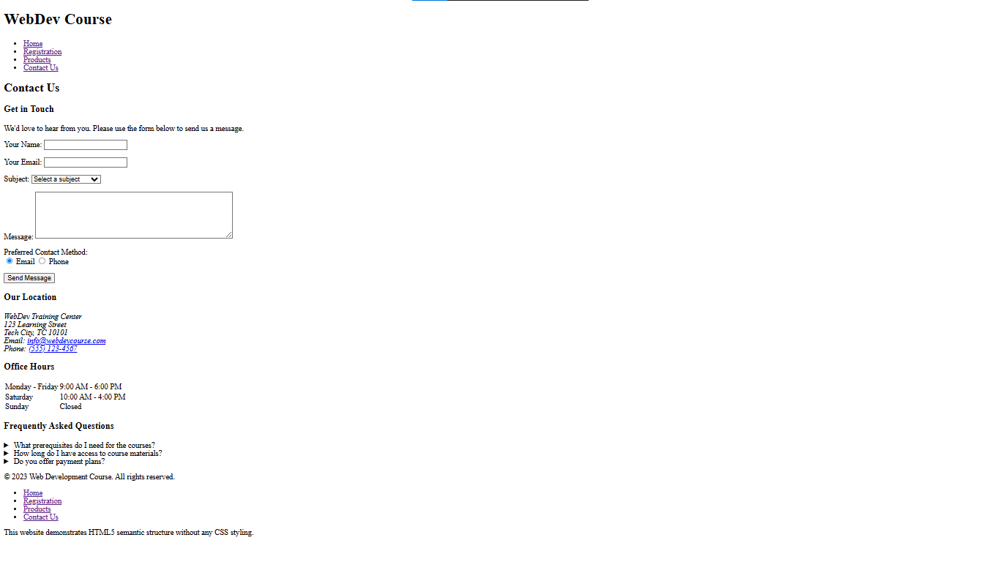
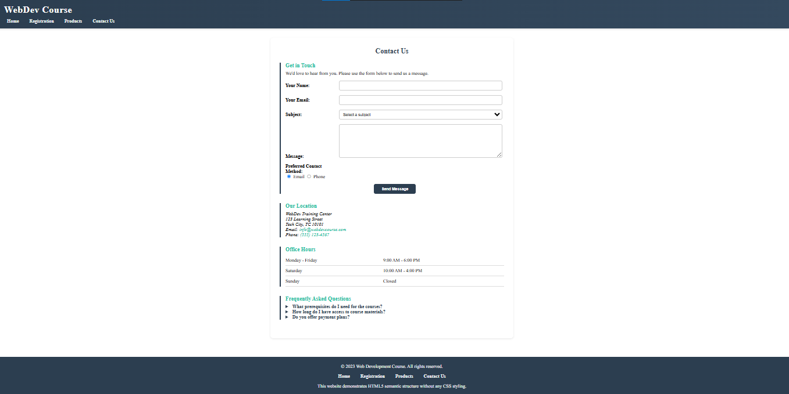

# Assignment 1

## Objective

Create a style sheet for given code 

## Index before Styling

## Index after Styling

|-------------------------------------------------------
-------------------------------------------------------

## Registeration before Styling

## Registeration after Styling

|-------------------------------------------------------
-------------------------------------------------------

## Product before Styling

## Product after Styling

|-------------------------------------------------------
-------------------------------------------------------

## Contact before Styling

## Contact after Styling

-------------------------------------------------------