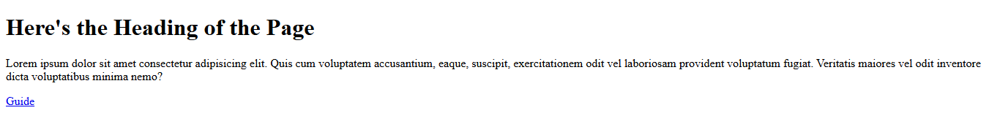

# CategoryA - Exercise # 1 


```
• Use <!DOCTYPE html>.
• Set <html lang> appropriately.
• Include <head> with:
• <meta charset="UTF-8">
• <meta name="viewport" content="width=device-width, initial-scale=1">
• <meta name="description"> (concise summary).
• A meaningful <title>.
• Two <link> tags: a stylesheet and a favicon.
• Add <base href="https://mysite.example/resources/">.
• In <body>: add a heading, a paragraph, and a relative link to 'guide.html' (it must resolve via <base>). 
```

Here's the Output :- 


