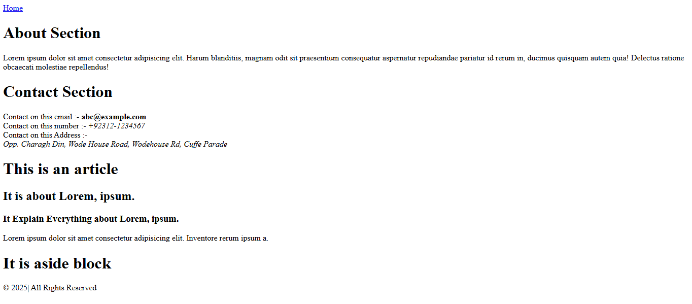

# CategoryB - Exercise # 1 


```
• Create 'home.html' with <header>, <nav>, <main>, two <section> blocks, one <article>, one <aside>,
and <footer>.
• Add an <address> block inside Contact section.
• Ensure headings (h1–h3) reflect a logical outline
```


Here's the Output :- 


