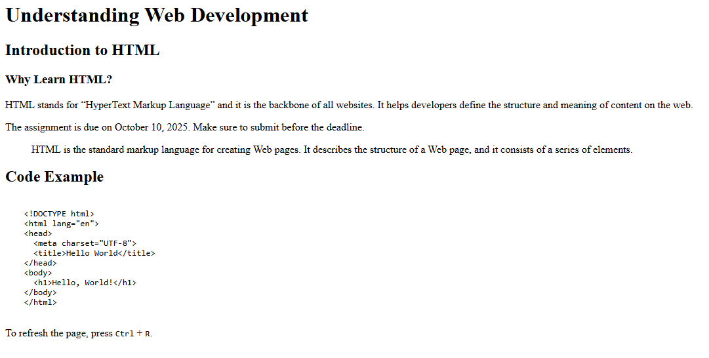

# CategoryC - Exercise # 1 


```
• Create 'article.html' with <h1>–<h3>, two <p> blocks, and a <blockquote> with a cite URL.
• Include a due date using <time>, and one inline quote using <q>.
• Show one code sample using <pre><code>…</code></pre> and one keyboard hint with <kbd>. 
```


Here's the Output :- 


