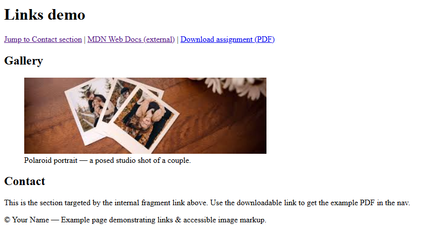

# CategoryC - Exercise # 1 


```
• Create 'links.html' with: an internal fragment link, an external link in a new tab (rel="noopener"), and a
downloadable link.
• Add an image with meaningful alt text.
• Wrap the image in <figure> with a <figcaption>.
```


Here's the Output :- 


