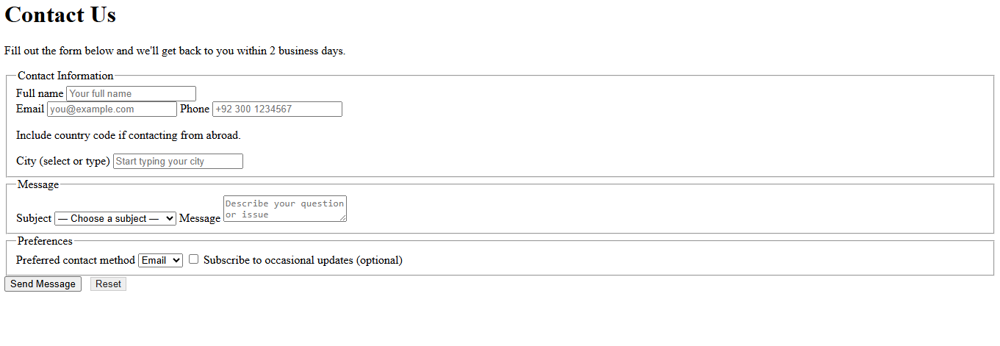

# CategoryF - Exercise # 1 


```
• Build 'contact.html' with a form that includes: <label>/<input> (email, tel), <textarea> for message, and
a <select> for subject.
• Group related inputs with <fieldset>/<legend>.
• Add a <datalist> for city suggestions and a <button> to submit. 
```


Here's the Output :- 


